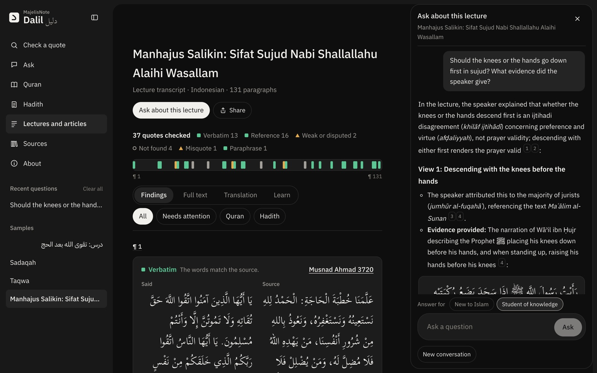

<h1 align="center">MajelisNote Dalil</h1>

<p align="center">Checks the ayat and hadith quoted in lectures and articles against their sources, word for word, and shows who graded each hadith.</p>

<p align="center">
  <a href="https://hadits.net">Live site</a> ·
  <a href="https://hadits.net/ar/">العربية</a> ·
  <a href="docs/how-it-works.md">How it works</a> ·
  <a href="docs/running.md">Run it</a> ·
  <a href="LICENSE">MIT</a>
</p>

<p align="center"></p>

## Why

Speakers quote hadith from memory. A word changes, a weak narration is passed on as sound, or the saying is not a hadith at all. Listeners have no quick way to check. A general chatbot makes it worse: it writes Arabic that looks like a hadith and invents grades.

Dalil never writes scripture. It finds the quote, reads the source text from its database by key, compares them word for word, and shows the grades as the graders gave them.

## What it does

| Tool | You give | You get |
| --- | --- | --- |
| Check a quote | Words, a reference ("HR Muslim 1631", "QS 2:255") or a remembered meaning, in Arabic, English or Indonesian | The source, a status, the changed words, every grade with its grader, other collections with the same text |
| Lecture and article reports | A transcript, an article, or a `.txt` `.md` `.srt` `.vtt` file | Every quote found and checked, marked in the full text |
| Ask | A question, alone or beside a report | An answer built only from what its tools return, every claim cited |
| Translate | A report and a target language (EN, AR, ID) | The text translated, with verses and hadith in their published translations |
| Glossary | A click on an underlined term, or a selection | What the term means in this passage, and a question for Ask |
| Learn | A report | Dalil cards on a spaced schedule and a quiz linked to the paragraphs |
| Browse | `/quran`, `/hadith`, `/bukhari:1` | Text, translation, narrator chain, grades, other wordings |

Corpus: the Quran (6,236 ayat) and 317,032 hadith in 40 collections.

## Quick start

Runs on a small sample corpus that ships with the repo. No Cloudflare account needed.

```bash
bun install
cp .env.example .dev.vars     # add GEMINI_API_KEY for the AI steps (optional)
bun run local:setup           # load sample/ into local D1 and KV
bun run dev                   # http://localhost:4321
```

## Docs

| Read | For |
| --- | --- |
| [Idea](docs/idea.md) | The problem, who it is for, and the rules the product keeps |
| [How it works](docs/how-it-works.md) | The checking pipeline, statuses, reports, Ask, translation, glossary |
| [Running and deploying](docs/running.md) | Local setup, commands, tests, deploy |
| [Environment](docs/env.md) | Secrets, variables and Cloudflare bindings |
| [Data](docs/data.md) | Sources, licences, the sample corpus, rebuilding the full corpus |
| [API](docs/api.md) | HTTP endpoints |
| [Evaluation](docs/evaluation.md) | Test sets, results, how to rerun |
| [Things to know](docs/things-to-know.md) | Rules and traps before changing code |
| [Design](docs/design.md) | Visual direction every page follows |
| [Limits and next steps](docs/limits.md) | What it does not do yet |

## Stack

Cloudflare Workers (Astro SSR, Vue 3 islands, Hono API), D1, Vectorize, KV, Durable Objects, AI Gateway, Gemini, AI SDK, Bun.

## Licence and sources

Code: [MIT](LICENSE).

The full corpus is not in this repository; the sample in `sample/` holds only Unlicense hadith text and Quran Arabic. Each source's terms are in [Data](docs/data.md).

Disputes, corrections and source suggestions: [hadits.net/sources](https://hadits.net/sources).
